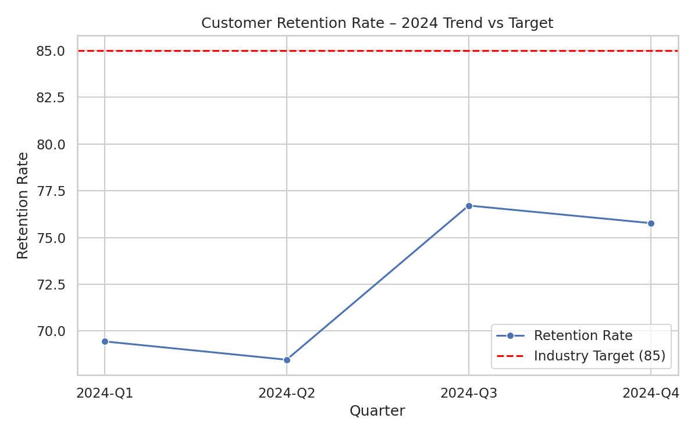

# Customer Retention – 2024 Analysis

**Verification email:** 21f2000670@ds.study.iitm.ac.in

- Average retention rate: **72.59**
- Industry target: **85**
- Gap to target (Q4): 9.23

## Key findings
- Retention improved in Q3 and Q4 but still below target.
- Average across 2024 is **72.59** vs. target 85.

## Business implications
- Underperformance means higher churn and risk of lost revenue.

## Recommendations
- Aim for +3 to +4 points uplift per quarter.
- Improve onboarding, support, and feature adoption.
- Monitor early churn signals (drop in usage, support complaints).

## The solution: "implement targeted retention campaigns"
- Run campaigns for at-risk customers.
- Provide incentives and proactive support.
- Use CRM automation to improve retention.

